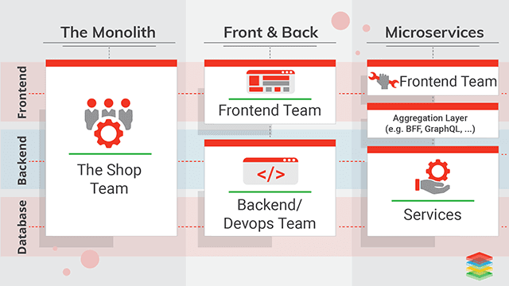

# 微前端笔记

图：Web 应用演变

## 单体应用出现的痛点

- 代码量增大（复杂，难修复 Bugs）
- 多团队间依赖复杂（牵一发而动全身、沟通成本、矛盾激增）
- 测试时间长
- 从提交到发布周期变长
- 技术栈限制，难应用新的技术栈
- 不能独立开发、独立部署

## 微前端

- 小而美
- 聚合
- 低耦合
- 易于测试
- 独立开发
- 独立部署
- 技术无关性
- 敏捷开发 + DevOps

### 小而美

单一职责，每个微前端只需关注某一功能点上。代码量少、更易于优化、重构和维护。

### 聚合

采用微服务架构是解耦服务间的依赖，而在前端微服务化上是聚合（非耦合，即将不同的微前端聚合在一起，形成一个的整体呈现在用户面前）

### 低耦合

- 前后端分离
- 数据驱动

### 易于测试

更能专注于测试自己的功能点

### 独立开发

更加细粒度的将应用拆分成小的模块（多个组件聚合的业务单元）或组件（基础/公用组件、原子性），模块与应用可以是一对多关系（公用模块），也可以是一对一关系（单业务模块）

### 独立部署

每个独立开发的微前端都可以独立通过 CI/CD 部署到不同的环境上。

### 技术无关性

和微服务一样，微前端不限制技术栈。选择更适合自己团队的技术或框架

###  敏捷开发 + DevOps

在敏捷开发中以用户需求为中心，快速迭代不断交付有价值的软件，实现客户满意度。采用微前端可以做到快速开发、快速测试、持续部署。

## 实施微前端用到的技术

- 通过后端模板引擎插入 HTML
- iFrame（PostMessage）
- 客户端模块加载器（RequireJS 或 SystemJS）
- WebComponents
- 微服务框架（single-spa）
- 数据交互、通信（CustomEvent、EventBus、状态管理库）

## 其他
- 即使是技术无关性，也不要一味、盲目地追求新的技术栈。限定几个技术栈可能会更好
- 代码要规范化（可通过 EditorConfig 和各种 Lint 检测）、最好文档化（JSDoc、docsify）。
- 有自己的命名空间
- 优化